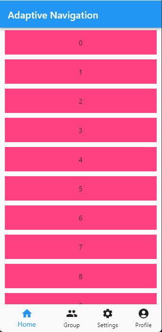
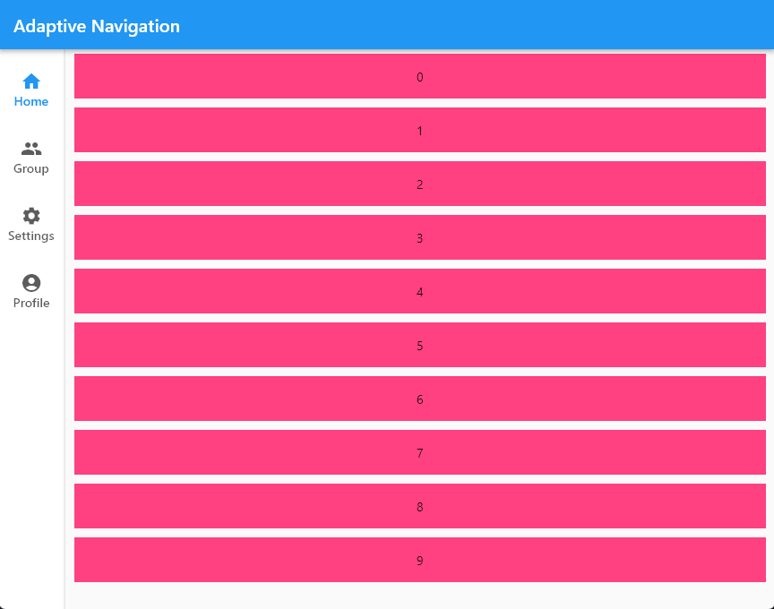
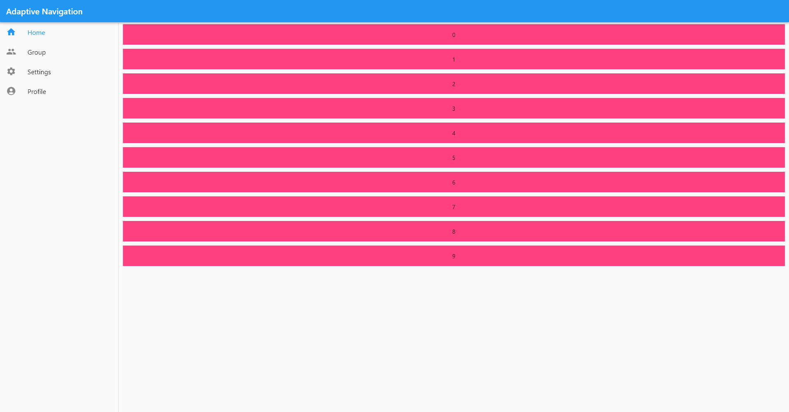

# flutter_adaptive_navigation

A flutter package that simplifies the process of adding adaptive navigation to your apps. 

It uses bottom navigation bar for mobile phones, navigation rail for tablets, and drawers for desktop size screens.

## Features

TODO: List what your package can do. Maybe include images, gifs, or videos.

## Getting started

Import the package:

```dart
import 'package:flutter_adaptive_navigation/flutter_adaptive_navigation.dart';
```

Use the `FlutterAdaptiveNavigationScaffold` instead of the regular `Scaffold`.

## Usage

TODO: Include short and useful examples for package users. Add longer examples
to `/example` folder.

```dart
FlutterAdaptiveNavigationScaffold(
      labelDisplayType: LabelDisplayType.all, // Optional. Determines which labels to display on Tablets and Mobile screens. Ignored on desktops. Defaults to showing only the selected labels.
      appBar: AppBar(
        title: const Text('Adaptive Navigation'),
      ), // Optional. Defines the widget to be used as the appBar.
      drawerWidthFraction: 0.15, // Optional. Determines the width of the drawer in terms of percentage of the viewport width. Default: 20%. Should be expressed as a fraction (between 0 and 1)
      destinations: [
        NavigationElement(
          icon: const Icon(Icons.home),
          label: 'Home',
          builder: () => const CustomListView(
            count: 10,
            color: Colors.pinkAccent,
          ),
        ),
        NavigationElement(
          icon: const Icon(Icons.group),
          label: 'Group',
          builder: () => const CustomListView(
            count: 10,
            color: Colors.red,
          ),
          breakpointBasedBuilder: {
            Breakpoint.tablet: () => const CustomGridView(
                  count: 10,
                  color: Colors.blue,
                )
          },
        ),
        NavigationElement(
          icon: const Icon(Icons.settings),
          label: 'Settings',
          builder: () => const CustomListView(
            count: 10,
            color: Colors.amberAccent,
          ),
          breakpointBasedBuilder: {
            Breakpoint.desktop: () => const CustomGridView(
                  count: 10,
                  color: Colors.orange,
                )
          },
        ),
        NavigationElement(
          icon: const Icon(Icons.account_circle),
          label: 'Profile',
          builder: () => const CustomListView(
            count: 10,
            color: Colors.indigo,
          ),
        ),
      ], // Required. The list of destinations for the navigation in the app. Should have atleast 1 element.
    );
```

For `NavigationElement`,

```dart
NavigationElement(
          icon: const Icon(Icons.home_outlined), // Required. The icon to be displayed in the navigation
          selectedIcon: const Icon(Icons.home), // Optional. Will be used if specifed for active page.
          label: 'Profile', // Required. The label for navigation
          builder: () => const CustomListView(
            count: 10,
            color: Colors.indigo,
          ), // Optional. Specifies the widget to be displayed as the main contents of the screen. Will be used at all breakpoints. Do specify either this or `breakpointBasedBuilder`
          breakpointBasedBuilder: {
            Breakpoint.desktop: () => const CustomGridView(
                  count: 10,
                  color: Colors.orange,
                )
          }, // Optional. Allows to override main contents for specific device types.
        )
```

## Screenshots

#### Bottom Navigation Bar



#### Navigation Rail



#### Navigation Drawer


